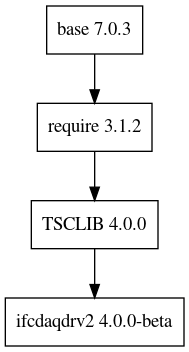

e3-ifcdaqdrv2
====
IFCDAQDRV2 is the library that implements an API to access IOxOS MTCA cards using TSC driver


## Dependency Plot

||
| :---: |
|**Figure 1** Depdendency Tree. |


## ESS bitbucket account is need

One needs to have the ESS bitbucket accout. **make ini** will ask the ESS user name and its password. In order to minimize that case, one can add the ssh key in ones account. After that, the following command should be executed in order to use the different url instead of the default one.


```
git config --global url."git@bitbucket.org:".insteadOf https://bitbucket.org/
```
